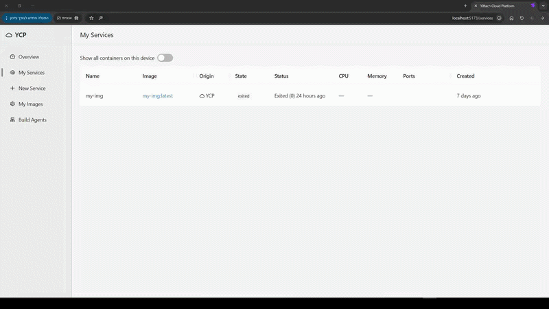
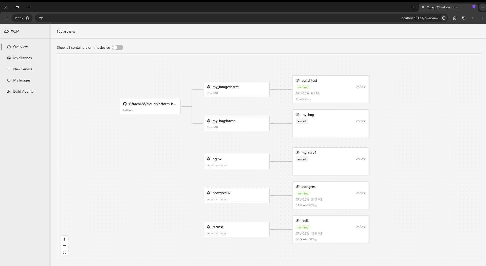
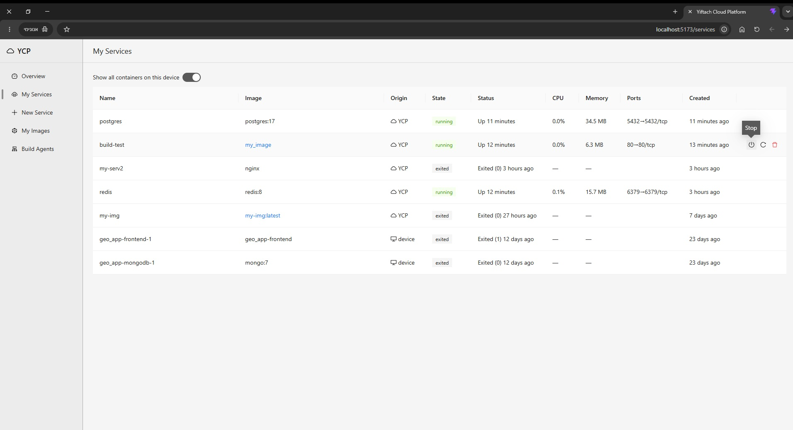
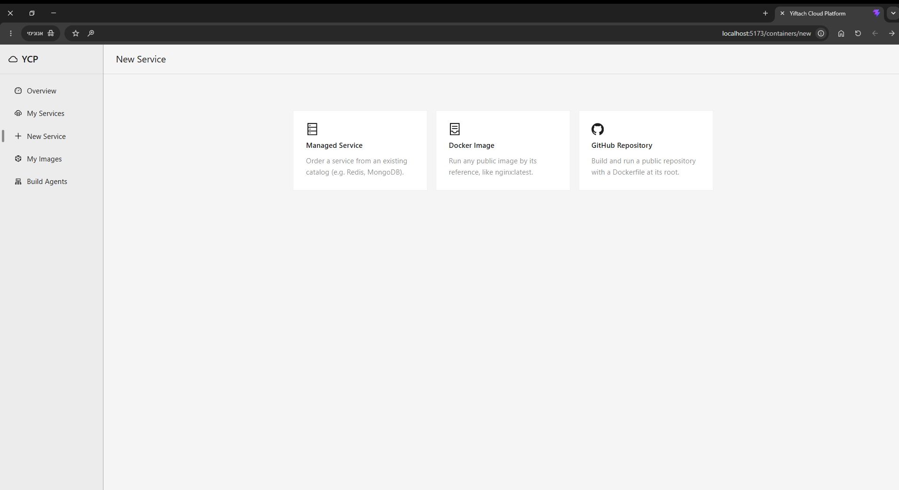
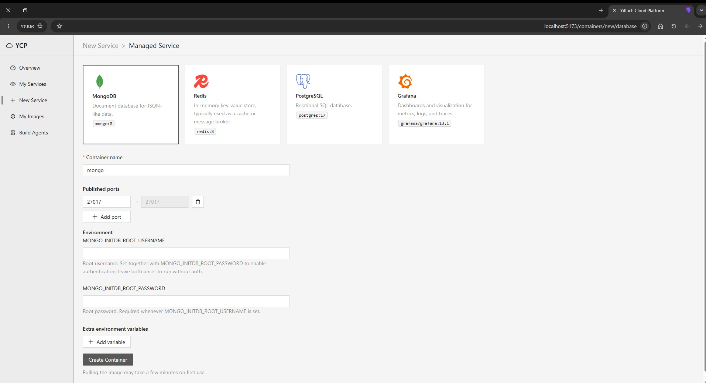
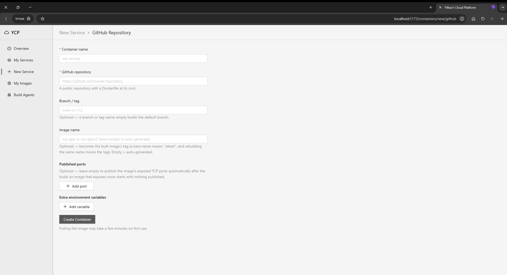
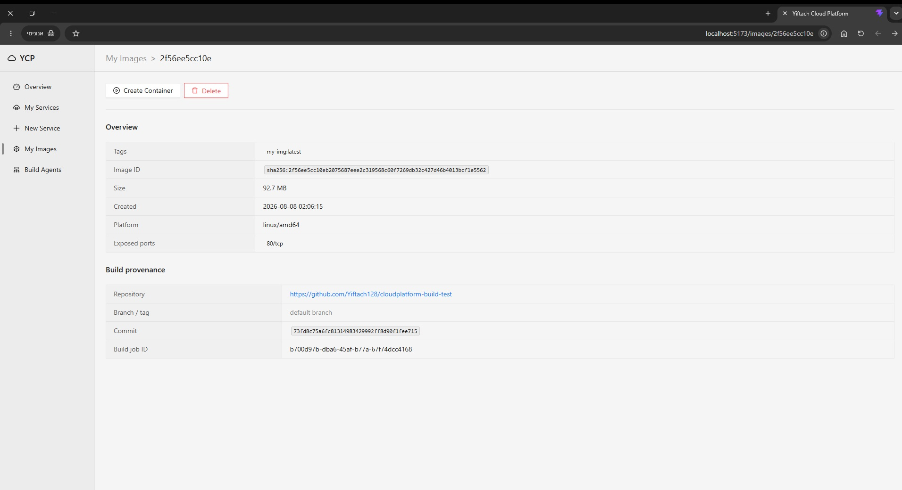

# YCP - Yiftach Cloud Platform

YCP is a self-hosted cloud control panel for deploying and managing Docker containers from a simple web UI, with Docker daemon as the only source of truth. YCP has live overview of your containers, a variety of managed services you can order, and safe build agents for GitHub repos - so untrusted code can never cause your cloud to crash. 



User can order services from a ready-made preset (mongoDB, postgres, redis, etc...), any Docker image, or a GitHub repository — and the platform turns it into a running container you can watch, manage, and inspect from the browser. Everything runs locally on Windows, with the Docker daemon living inside WSL2.

The project is split into three standalone packages: a platform backend (with REST API), build agents (microservices that do the image builds from GitHub repos), and a React frontend.

## Features

- **Overview** — a live map of the whole deployment, drawn with ReactFlow: GitHub repo → image → container, with live CPU and memory stats on every container node.

- **My Services** — all your containers in one table with live stats. Start, stop, and delete them, or open a service to see its details, resource usage, and logs (with live updates).

- **New Service wizard** — three ways to create a service: a managed preset (Postgres, Redis, etc, with sensible default ports), any image from a registry, or a GitHub repository.

- **Build Queue** — when you submit a GitHub repo, the client posts a build request to a queue in the backend server. Build agents poll the queue when they're idle and take build jobs off it, so builds never block the API.

- **Build from GitHub** — paste a repo URL (optionally with `#branch` or `#tag`), and a build agent clones it, builds the image with BuildKit, and reports the build log live to your browser. When the build finishes, the container is created and started automatically. If you didn't specify ports, the platform publishes the ports the image exposes on its own.

- **My Images** — every image built by the platform, each with a details page showing its exposed ports and full build provenance: a link back to the source repository, the branch or tag, the exact commit, and the build job that produced it.

- **Build Agents microservices** — the builds run in a separate worker service, not in the API server. You can have several agents polling the job queue. Builds are contained: repos are cloned safely by the microservice instead of on the main backend server, so untrusted code can never cause the app to crash. The Build Agents page shows every agent live via heartbeats — idle, building, or offline, with uptime and last-seen time.

- **Self-healing Docker daemon** — When a request finds the daemon down, the backend boots the WSL distro by itself, and holds the distro open for as long as the server runs.


## How it works

Three standalone npm packages, no workspaces:

- **`platform-backend/`** — an Express 5 REST API (`/api/v1`) that talks to the Docker daemon through dockerode. It owns the container and image endpoints, the FIFO build queue, and the build-agent registry.

- **`builder-service-backend/`** — the build agents microservice that polls the platform server: claim a job → clone the repo → build the image with BuildKit → resolve the ports → create the container through the platform API → report the result. It sends heartbeats the whole time so the UI knows it's alive.

- **`frontend/`** — React UI that only talks to the platform API.

So a GitHub build flows like this: the wizard posts one request with the repo URL and the container config. The platform queues it. An idle build agent claims it, clones the repo, builds the image (reports progress lines back so the browser shows a live log), then asks the platform to create and start the container.

## Tech stack

**Backend**
- Node.js 24 running TypeScript natively — no build step, the source imports real `.ts` files
- Express 5
- dockerode (Docker Engine API client)
- axios, tar

**Frontend**
- React 19 + TypeScript
- Ant Design 6
- ReactFlow (`@xyflow/react`) for the overview graph
- react-router 8, axios
- Vite 8, oxlint

**Infrastructure**
- Docker with BuildKit, running inside WSL2 Ubuntu
- git CLI for shallow clones


## Screenshots

**Overview — the live deployment map**



**My Services — containers with live stats**



**New Service — pick a source**



**New Service — managed preset**



**New Service — build from a GitHub repo**



**Image details — build provenance**




## Getting started

### Prerequisites

- Windows with **WSL2** and an Ubuntu distro
- **Docker** installed inside WSL2, with the daemon listening on `tcp://127.0.0.1:2375`
  (it must bind IPv4 explicitly — WSL's localhost relay does not forward IPv6 listeners, so `tcp://0.0.0.0:2375` won't be reachable from Windows)
- **Node.js 24** or newer
- **git** on your PATH (the build agent uses it for cloning)

### Install

```bash
git clone https://github.com/Yiftach128/yiftach-cloud-platfrom.git
cd yiftach-cloud-platfrom

cd platform-backend && npm install && cd ..
cd builder-service-backend && npm install && cd ..
cd frontend && npm install && cd ..
```

### Configure

Both backends have a `.env.example` you can copy to `.env`. Every variable is optional — the defaults are made for local development. The main ones:

| Variable | Package | Default | What it does |
|---|---|---|---|
| `PORT` | platform-backend | `3000` | API port |
| `DOCKER_HOST` | both backends | `tcp://127.0.0.1:2375` | Where the Docker daemon lives |
| `PLATFORM_API_URL` | builder-service-backend | `http://127.0.0.1:3000/api/v1` | Where the agent finds the platform |
| `AGENT_NAME` | builder-service-backend | machine hostname | The agent's name on the Build Agents page |

### Run

Open three terminals:

```bash
# 1 — the platform API (port 3000)
cd platform-backend && npm run dev

# 2 — a build agent (no port, it polls the platform)
cd builder-service-backend && npm run dev

# 3 — the frontend (port 5173, proxies /api to the backend)
cd frontend && npm run dev
```

Then open **http://localhost:5173**.

You don't need to start WSL yourself — the first request that finds the daemon down boots it automatically (a cold start takes around 10 seconds).
